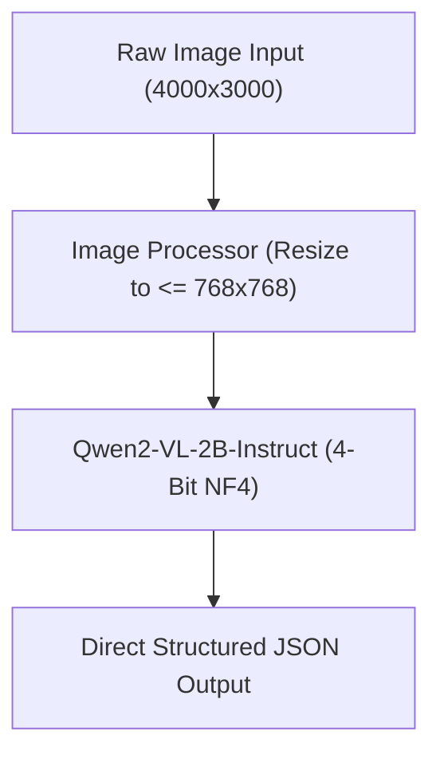
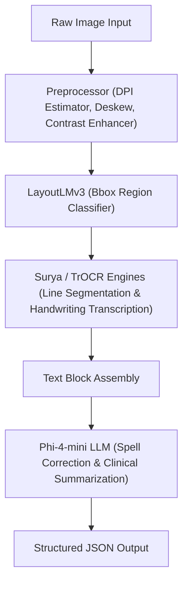

# Reference Guide: OCR Engine Architectures & Comparison

This document provides a comparative reference for the two OCR engine tracks designed for the Medical HealthCare OCR system. It details their architectures, capabilities, resource requirements, and contains step-by-step verification and execution instructions.

---

## Technical Architectures Comparison

Below is the side-by-side comparison of the two tracks implemented in the system.

| Dimension | Track A: Unified VLM (`Qwen2-VL-2B-Instruct`) | Track B: Optimized Multi-Stage Pipeline |
| :--- | :--- | :--- |
| **Workflow Complexity** | **Low:** Single-stage feed-forward pass. Visual inputs map directly to structured JSON outputs. | **High:** Preprocessing -> Layout Detection -> Text Recognition -> LLM Post-correction -> Clinical Summarization. |
| **Model Size / Weight** | ~2 Billion parameters. Loaded in **4-bit quantized (NF4)** format using `bitsandbytes` to reduce weight. | Multiple sub-models (LayoutLMv3 ~125M, Surya2 ~75M, TrOCR ~60M, Phi-4-mini ~3.8B). |
| **Image Resolution Handling** | Capped at `768 * 768` pixels (`max_pixels`) to prevent VRAM overflows. | Dynamically processes large high-res documents (splits, crops, deskews, and filters). |
| **Memory Footprint (VRAM)** | **Low / Constant:** ~1.8 GB VRAM footprint. Constant throughout inference. | **High / Dynamic:** Loads layout and recognition models sequentially, unloads them to CPU, then loads Phi-4-mini (~3.0 GB VRAM peaks). |
| **Processing Speed (Latency)** | **Fast:** Typically **3.5s - 5s** total pipeline execution. | **Moderate:** Typically **45s - 55s** due to multiple inference loops (90+ lines recognized sequentially by TrOCR). |
| **Handwriting Accuracy** | **Very High:** Excellent at deciphering context and scribbled doctor notes directly from pixels. | **Moderate:** Relies on smaller `trocr-small-handwritten` OCR engine post-corrected by LLM. |
| **Structured Output Format** | Direct generation of schema-compliant JSON via structured system instructions. | Multi-stage dictionary parsing from OCR output post-processed and summarized by Phi-4. |

---

## Workflows

### Track A (Unified VLM) Flow


### Track B (Optimized Multi-Stage) Flow


---

## Critical System & Dependency Alert

> [!CAUTION]
> **Python 3.14 Compatibility Issue**:
> Running this pipeline under Python 3.14 using system-level python commands will load pre-release/newer versions of PyTorch (`2.12.0+cu130`) and Transformers (`5.12.1`). This combination contains a regression in weights copying / batch norm initialization for Segformer/EfficientViT architectures, causing the Surya text-line detector to output flat heatmaps. This makes the pipeline fail to detect individual text lines, resulting in empty layouts or a single large bounding box covering the entire page boundaries.
> 
> **Resolution**: Always run the application using the local Python 3.12 virtual environment `venv\Scripts\python.exe`.

---

## Step-by-Step Execution Guide

### 1. Environment Verification
Verify that the virtual environment interpreter and CUDA backend are functional:
```powershell
venv\Scripts\python.exe -c "import torch; print('CUDA Available:', torch.cuda.is_available()); print('Device Name:', torch.cuda.get_device_name(0) if torch.cuda.is_available() else 'None')"
```

### 2. Verify Track A (Unified VLM) Run
Run the quick verification script for Track A to inspect VLM output:
```powershell
venv\Scripts\python.exe C:\Users\oliad\.gemini\antigravity-ide\brain\01325514-5dac-4a11-9834-6cf2d9eb7fda\scratch\test_pipeline_vlm.py
```

### 3. Verify Track B (Optimized Multi-Stage) Run
Run the quick verification script for Track B to trace the preprocessing, layout detection, OCR transcription, and Phi-4 clinical summarization stages:
```powershell
venv\Scripts\python.exe C:\Users\oliad\.gemini\antigravity-ide\brain\01325514-5dac-4a11-9834-6cf2d9eb7fda\scratch\test_pipeline_stageb.py
```

### 4. Running the Web Application
To start the side-by-side comparative UI in the web browser, launch the FastAPI server from the workspace root:
```powershell
venv\Scripts\python.exe app.py
```
Open your browser and navigate to the application address (typically `http://localhost:8000`). Select your desired track or run comparison tests dynamically on any patient lab report or medical document.
